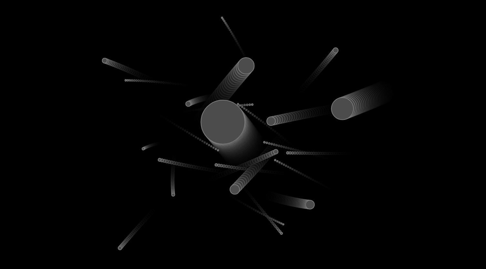

# NoColJs

Multi object orbiting simulation converging towards collision free trajectories.

This is a JavaScript rewite of Jean Tampons wonderful [NoCol](https://github.com/johnBuffer/NoCol) project (written in C++).



You can run the simulation right in your browser ( [link](https://mablay.github.io/NoColJS) ). See keyboard shortcuts below.

## User Interaction

* <kbd>E</kbd> toggle v-sync. V-sync limits the number of frames per second, so disabling it speeds up the simulation.
* <kbd>S</kbd> single step animation.
* <kbd>space</kbd> toggle animation
* <kbd>R</kbd> reset the view.
* <kbd>mouse-click</kbd> to spawn a new object.

On a Mac you can pan and scroll around. Not sure if it behaves the same way on Windows and Linux.

## Setup
If you want to experiment with the code. Here's how you setup the project.

Requirement: NodeJS v10+

```sh
git clone git@github.com:mablay/NoColJS.git
cd NoColJS
npm install
```

## Run

```sh
npm start
```
